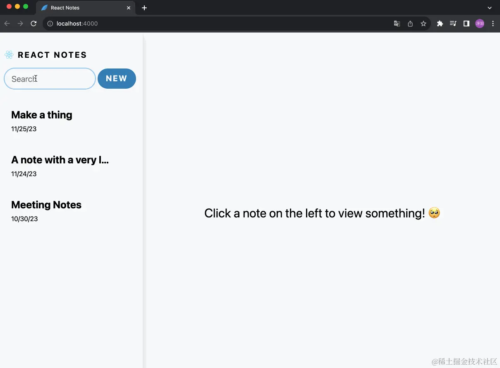

## current branch 对应如下文档

[redis](https://redis.io/docs/latest/operate/oss_and_stack/install/install-stack/mac-os/)

[ioredis](https://github.com/redis/ioredis)

## 一、图例



## 二、修改根布局和其他页面

修改 [app/page.tsx](app/page.tsx)：

```ts
// app/page.js
export default async function Page() {
  return (
    <div className="note--empty-state">
      <span className="note-text--empty-state">
        Click a note on the left to view something! 🥺
      </span>
    </div>
  );
}
```

<br />
<br />

修改 [app/layout.tsx](app/layout.tsx)：

```ts
import "./style.css";
import Sidebar from "@/components/Sidebar";

export default async function RootLayout({ children }) {
  return (
    <html lang="en">
      <body>
        <div className="container">
          <div className="main">
            <Sidebar />
            <section className="col note-viewer">{children}</section>
          </div>
        </div>
      </body>
    </html>
  );
}
```

<br />
<br />

新建 [app/components/Sidebar.tsx](app/components/Sidebar.tsx)，代码为：

```ts
import React from "react";
import Link from "next/link";

export default async function Sidebar() {
  return (
    <>
      <section className="col sidebar">
        <Link href={"/"} className="link--unstyled">
          <section className="sidebar-header">
            
            <strong>React Notes</strong>
          </section>
        </Link>
        <section className="sidebar-menu" role="menubar">
          {/* SideSearchField */}
        </section>
        <nav>{/* SidebarNoteList */}</nav>
      </section>
    </>
  );
}
```

<br />

Copy： [app/style.css](https://github.com/IsMShmily/nextjs_teaching/blob/notes_01/app/style.css) 内容

<br />

如果步骤正确的话，此时再访问 http://localhost:3000/ 应该效果如下：


### 三、使用 redis

使用 Redis 很简单，一共分为三步：

#### 1、安装 redis

```yaml
# macos
brew install redis
```

#### 2、启动 redis

```yaml
redis-server
```


#### 3、使用 ioredis

```yaml
pnpm i ioredis
```

## 四、 redis 的 CURD

新建 [lib/redis.ts](lib/redis.ts) 代码如下：

```ts
import Redis from "ioredis";

/**
 * 创建 Redis 客户端实例
 * 默认连接到本地 Redis 服务器 (localhost:6379)
 */
const redis = new Redis();

/**
 * 初始数据
 * 当 Redis 中没有数据时，使用这些数据初始化
 * 每条笔记包含：
 * - title: 标题
 * - content: 内容
 * - updateTime: 更新时间
 */
const initialData = {
  "1702459181837":
    '{"title":"sunt aut","content":"quia et suscipit suscipit recusandae","updateTime":"2023-12-13T09:19:48.837Z"}',
  "1702459182837":
    '{"title":"qui est","content":"est rerum tempore vitae sequi sint","updateTime":"2023-12-13T09:19:48.837Z"}',
  "1702459188837":
    '{"title":"ea molestias","content":"et iusto sed quo iure","updateTime":"2023-12-13T09:19:48.837Z"}',
};

/**
 * 获取所有笔记
 * 如果 Redis 中没有数据，则使用初始数据
 * @returns Promise<Record<string, string>> 所有笔记的哈希表
 */
export async function getAllNotes() {
  const data = await redis.hgetall("notes");
  if (Object.keys(data).length == 0) {
    await redis.hset("notes", initialData);
  }
  return await redis.hgetall("notes");
}

/**
 * 添加新笔记
 * @param data 笔记数据（JSON 字符串）
 * @returns Promise<string> 新笔记的 UUID
 */
export async function addNote(data: any) {
  const uuid = Date.now().toString();
  await redis.hset("notes", [uuid], data);
  return uuid;
}

/**
 * 更新指定笔记
 * @param uuid 笔记的唯一标识符
 * @param data 更新的笔记数据（JSON 字符串）
 */
export async function updateNote(uuid: string, data: any) {
  await redis.hset("notes", [uuid], data);
}

/**
 * 获取指定笔记
 * @param uuid 笔记的唯一标识符
 * @returns Promise<object> 笔记数据对象
 */
export async function getNote(uuid: string) {
  return JSON.parse((await redis.hget("notes", uuid)) || "{}");
}

/**
 * 删除指定笔记
 * @param uuid 笔记的唯一标识符
 * @returns Promise<number> 删除的记录数
 */
export async function delNote(uuid: string) {
  return redis.hdel("notes", uuid);
}

export default redis;
```

## 五、修改组件 Sidebar

修改 [app/components/Sidebar.tsx](app/components/Sidebar.tsx) 内容为

```ts
import React from "react";
import Link from "next/link";
// 新增
import { getAllNotes } from "@/lib/redis";

export default async function Sidebar() {
  // 新增
  const notes = await getAllNotes();
  return (
    <>
        ...
        ...
        <nav>
           /** 新增 */
          <SidebarNoteList notes={notes} />
        </nav>
      </section>
    </>
  );
}
```

## 六、新增 SidebarNoteList

新增 [app/components/SidebarNoteList.tsx](app/components/SidebarNoteList.tsx) 代码：

```ts
export default async function NoteList({ notes }) {
  const arr = Object.entries(notes);

  if (arr.length == 0) {
    return <div className="notes-empty">{"No notes created yet!"}</div>;
  }

  return (
    <ul className="notes-list">
      {arr.map(([noteId, note]) => {
        const { title, updateTime } = JSON.parse(note);
        return (
          <li key={noteId}>
            <header className="sidebar-note-header">
              <strong>{title}</strong>
              <small>{updateTime}</small>
            </header>
          </li>
        );
      })}
    </ul>
  );
}
```

这时候我们打开 http://localhost:3000/ 应为下图所示：


同时打开 `RDM` 里面也有了 `redis` 的数据

下载链接 [https://redis.tinycraft.cc/zh/](https://redis.tinycraft.cc/zh/)


## 七、处理时间

下载 dayjs 依赖

```yaml
pnpm i dayjs
```

修改 [app/components/SidebarNoteList.tsx](app/components/SidebarNoteList.tsx)为：

```ts
  // 新增
import dayjs from "dayjs";
export default async function NoteList({ notes }: { notes: any }) {
  const arr = Object.entries(notes);
              ...
              ...
              // 新增
              <small>{dayjs(updateTime).format("YYYY/MM/DD HH:mm:ss")}</small>
            </header>
          </li>
        );
      })}
    </ul>
  );
}
```

打开 http://localhost:3000/ 时间变化为：


重要的是我们引用了 `day.js` 这个库。我们引入 `day.js` 的 `SidebarNoteList` 组件使用的是服务端渲染，这意味着 `day.js` 的代码并不会被打包到客户端的 `bundle` 中。我们查看开发者工具中的源代码：


你会发现 `node_modules` 并没有 `day.js`，但如果你现在在 `SidebarNoteList` 组件的顶部添加 '`use client`'，声明为客户端组件，你会发现立刻就多了 `day.js`：


这就是使用 `React Server Compoent` 的好处之一，服务端组件的代码不会打包到客户端的 `bundle` 中
