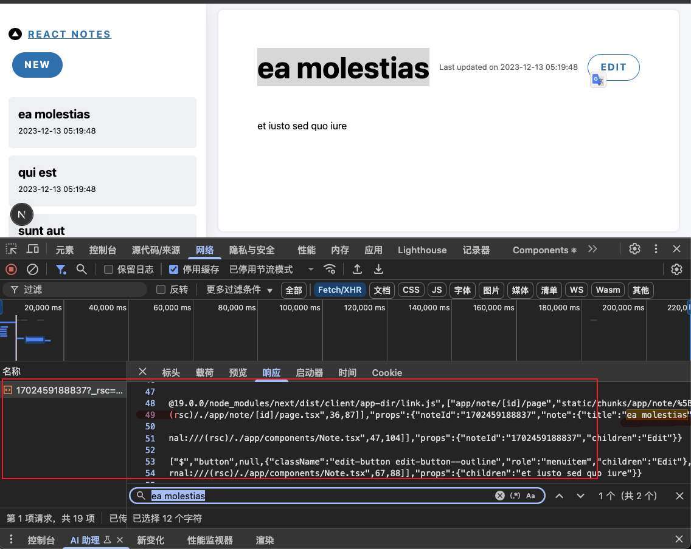

## nextjs 官方文档（current branch 对应如下文档）

[static-rendering-default](https://nextjs.org/docs/app/building-your-application/rendering/server-components#static-rendering-default)

[dynamic-rendering](https://nextjs.org/docs/app/building-your-application/rendering/server-components#dynamic-rendering)

[partial-prerendering](https://nextjs.org/docs/app/building-your-application/rendering/partial-prerendering)

[partial-rendering](https://nextjs.org/docs/app/building-your-application/routing/linking-and-navigating#4-partial-rendering)

---

## 一、静态渲染

新建：[app/server/page.tsx](app/server/page.tsx) 如下

```ts
const ServerPage = async () => {
  // 获取一张随机图片
  const randomImage = await fetch("https://api.thecatapi.com/v1/images/search");
  const imageData = await randomImage.json();
  const imageUrl = imageData[0].url;

  return (
    <div>
      
    </div>
  );
};

export default ServerPage;
```

当我们刷新页面的时候，每次都会调用 `img search` 的接口 获取一张猫猫图片：`pnpm run dev `打开 http://localhost:3000/server 我们可以看到


修改 [package.json](package.json) `build` 命令为 `"build": "next build && next start",` 打包运行 http://localhost:3000/server 页面，我们发现 刷新页面，猫猫图片也不会更新了


让我们查看 `build` 输出的结果：


`/server` 被标记为 `Static`，表示被预渲染为静态内容。也就是说，`/server` 的返回内容其实在构建的时候就已经决定了。页面返回的图片正是构建时调用猫猫接口返回的那张图片。

## 二、动态渲染

那么如何才能做到动态渲染？

在渲染过程中，如果使用了动态函数（`Dynamic functions`）或者未缓存的数据请求（`uncached data request`），`Next.js` 就会切换为动态渲染：

动态函数指的是获取只有在请求时才能得到信息（如 `cookie`、请求头、`URL` 参数）的函数。

在 `Next.js` 中这些动态函数是：

- `cookies()` 和 `headers()` ：获取 `cookie` 和 `header`
- `searchParams`：页面查询参数

使用这些函数的任意一个，都会导致路由转为动态渲染。


<br />

例 1：使用 cookies，见：[app/dy1](app/dy1)

```ts
import { cookies } from "next/headers";

const Dy1 = async () => {
  const cookieStore = await cookies();
  const theme = cookieStore.get("theme");
  console.log(theme);

  return <div>Dy1</div>;
};

export default Dy1;
```


我们可以看到 `（ƒ）/dy1` 被标记为了动态渲染

<br />

例 2：使用 searchParams，见[app/dy2/page.tsx](app/dy2/page.tsx)

```tsx
const Dy2 = async ({
  searchParams,
}: {
  searchParams: Promise<{ theme: string }>;
}) => {
  const { theme } = await searchParams;
  console.log(theme);

  return <div>Dy2</div>;
};

export default Dy2;
```


## 三、局部渲染

局部渲染意味着只有导航时发生变化的路线段才会在客户端重新渲染，并且任何共享的段都会被保留。

例如，在两个同级路由 `/dashboard/settings` 和 `/dashboard/analytics` 之间导航时， `settings` 页面将被卸载， `analytics` 页面将以最新状态挂载，共享 `dashboard` 布局将被保留。此行为也存在于同一动态段上的两个路由之间，例如` /blog/[slug]/page` 和从 `/blog/first` 导航到 `/blog/second` 。



如果没有部分渲染，每次导航都会导致整个页面在客户端重新渲染。仅渲染发生变化的部分可减少传输的数据量和执行时间，从而提高性能。
