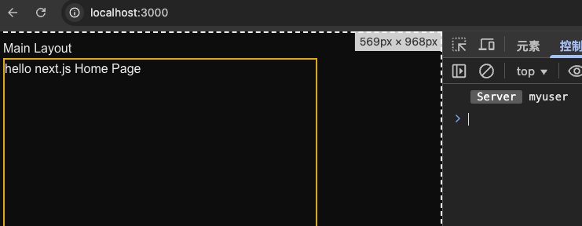
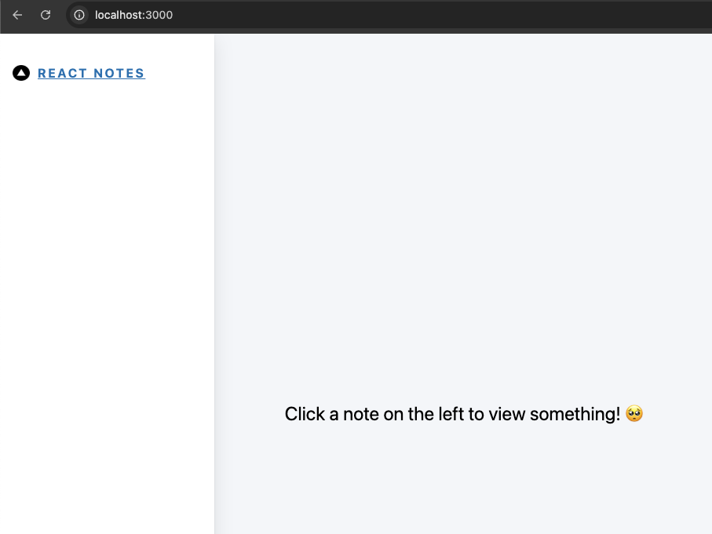
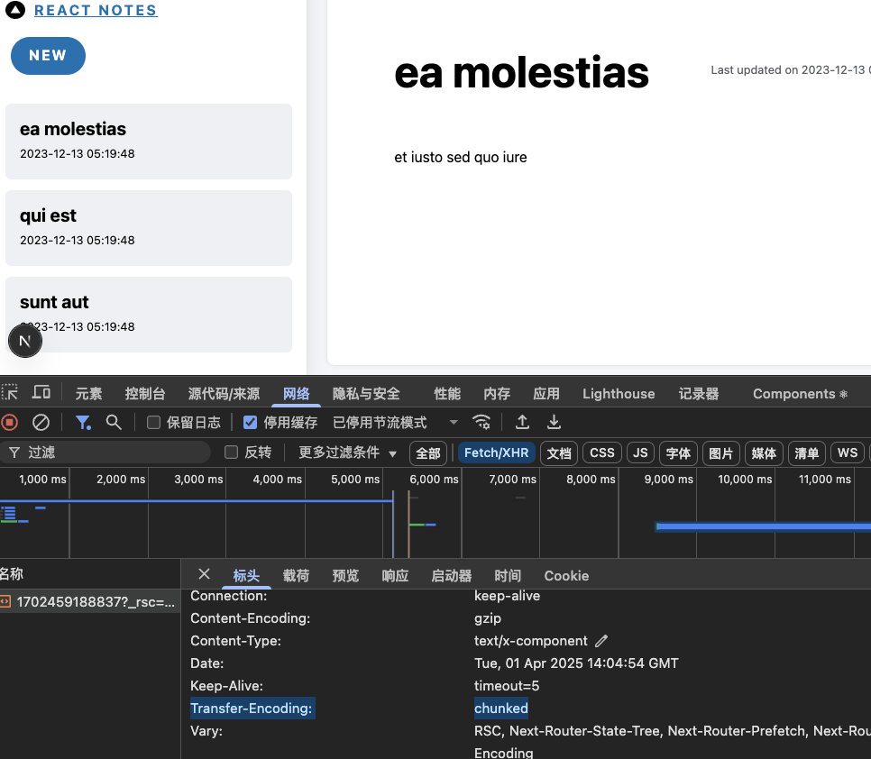

## nextjs 官方文档（current branch 对应如下文档）

[environment-variables](https://nextjs.org/docs/app/building-your-application/configuring/environment-variables)

---

## 一、如何使用 环境变量

`Next.js` 内置了对环境变量的支持，可让您执行以下操作：

- 使用 `.env` 加载环境变量
- 通过添加 NEXT*PUBLIC* 前缀来捆绑浏览器的环境变量

`Next.js` 内置支持将环境变量从 `.env` 文件加载到 `process.env` 中。

见：[.env](.env)

```base
DB_HOST=localhost
DB_USER=myuser
DB_PASS=mypassword
```

我们可以在服务端组件或者路由处理程序中通过 `process.env` 获取到该值,

### 1、服务端组件中使用

服务端组件中使用，见：[app/page.tsx](app/page.tsx)

```ts
export default function Home() {
  console.log(process.env.DB_USER);
  return (
    <div className="border-2 border-yellow-500 w-100 h-100">
      hello next.js Home Page
    </div>
  );
}
```



### 2、路由处理程序中使用

路由处理程序中使用，见：[app/api/route.ts](app/api/route.ts)

```ts
export async function GET() {
  console.log("get", process.env.DB_USER);
  return new Response("Hello, World!");
}
```

打开浏览器：访问 http://localhost:3000/api



### 3、浏览器中使用

Next.js 可以在构建的时候，将值内联到客户端的 `js bundle` 中，替换掉所有硬编码使用 `process.env.[variable]`的地方。不过为了告诉 `Next.js` 哪些值是可以让浏览器访问的，你需要在变量前添加 `NEXT_PUBLIC` 前缀，比如：

```md
NEXT_PUBLIC_SIGN=1a2b3c
```

如果没有 `NEXT_PUBLIC` 前缀，正常点击的时候获取的值会是 undefined ，添加 `NEXT_PUBLIC` 前缀后即可获取到正确的值。
见：[app/components/button/page.tsx](app/components/button/page.tsx)

```tsx
"use client";

const button = () => {
  const click = () => {
    console.log("NEXT_PUBLIC_SIGN", process.env.NEXT_PUBLIC_SIGN);
  };
  return (
    <button onClick={click} className="bg-blue-500 text-white p-2 rounded">
      Click me
    </button>
  );
};

export default button;
```



## 二、如何配置模块路径别名

Next.js 的 `tsconfig.json` 文件支持设置 "`paths`"和 "`baseUrl`"选项。

我们声明 `baseUrl` 为 `"."`，也就是项目根目录。

```ts
// tsconfig.json or jsconfig.json
{
  "compilerOptions": {
    "baseUrl": "."
  }
}
```

这些配置会帮助你更方便的导入模块，举个例子：
现在我们在根目录下的 `components` 文件夹下新建一个组件：

```ts
// before
import { Button } from "../../../components/button";

// after
import { Button } from "/components/button";
```

除了配置 `baseUrl` 路径之外，你也可以设置 "`paths`" 选项实现路径别名。举个例子：

```ts
// tsconfig.json
{
  "compilerOptions": {
    "baseUrl": ".",
    "paths": {
      "@/components/*": ["components/*"]
    }
  }
}
```

现在我们不需要使用相对地址，使用设置的路径别名即可：

```ts
// before
import { Button } from "../../../components/button";

// after
import { Button } from "@/components/button";
```
