## nextjs 官方文档（current branch 对应如下文档）

- [动态路由（Dynamic Routes）](https://nextjs.org/docs/app/building-your-application/routing/dynamic-routes)

- [路由组（Route Groups）](https://nextjs.org/docs/app/building-your-application/routing/route-groups)

- [平行路由（Parallel Routes）](https://nextjs.org/docs/app/building-your-application/routing/parallel-routes)

- [拦截路由（Intercepting Routes）](https://nextjs.org/docs/app/building-your-application/routing/intercepting-routes)

---

## 一、动态路由（Dynamic Routes）

### 1、[folderName]

可以通过将文件夹名称括在方括号中来创建动态细分：`[folderName]`。例如，`[id]`或`[slug]` 。

例如，博客可以包含以下路线`app/blog/[slug]/page.tsx` ，其中`[slug]`是博客文章的动态段。

动态段作为 params 属性传递给`layout` 、 `page` 、 `route`和`generateMetadata`函数。

见：[app/blog/[slug]/page.tsx](app/blog/[slug]/page.tsx)

```tsx
const Blog = async ({ params }: { params: Promise<{ slug: string }> }) => {
  const { slug } = await params;
  return <div>Blog: {slug}</div>;
};

export default Blog;
```

我们可以看到 `slug` 的值为 1 ，`slug`相当于一个`params`参数被`page`页面接收到了。

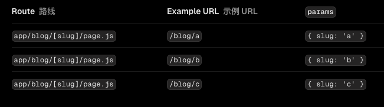

### 2、[...folderName]

通过在括号`[...folderName]`内添加省略号，可以将动态段扩展为捕获所有后续段。

见：[app/shop/[...slug]/page.tsx](app/shop/[...slug]/page.tsx)

```tsx
const Shop = async ({ params }: { params: Promise<{ slug: string }> }) => {
  const { slug } = await params;
  console.log(slug);
  return <div>Shop: {slug.toString()}</div>;
};

export default Shop;
```


### 3、[[...folderName]]

通过将参数包含在双方括号中，可以使 Catch-all Segment 成为可选项：`[[...folderName]]` 。

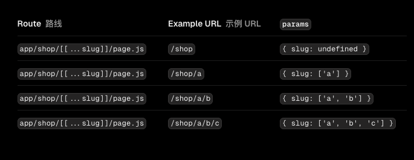

看起来是不是和`[...folderName]`没什么区别，

其实`[[...folderName]]` 和 `[...folderName]`与`[folderName]` 的区别在于不在参数会不会报错

比如当我们不带参数访问 `/blog` 与 `/shop `如下


而如果我们访问 `/hotdog` 则不会报错，见 [app/hotdog/[[...slug]]/page.tsx](app/hotdog/[[...slug]]/page.tsx)

```tsx
const HotDog = async ({ params }: { params: Promise<{ slug: string }> }) => {
  const { slug } = await params;
  console.log(slug);
  return <div>HotDog: {slug}</div>;
};

export default HotDog;
```

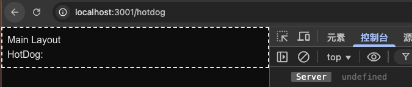

## 二、路由组（Route Groups）

### 1、按逻辑分组

在`app`目录中，嵌套文件夹通常会映射到 `URL` 路径。但是，您可以将文件夹标记为路由组，以防止该文件夹包含在路由的 `URL` 路径中。

这使您可以将路线段和项目文件组织成逻辑组，而不会影响 `URL` 路径结构。

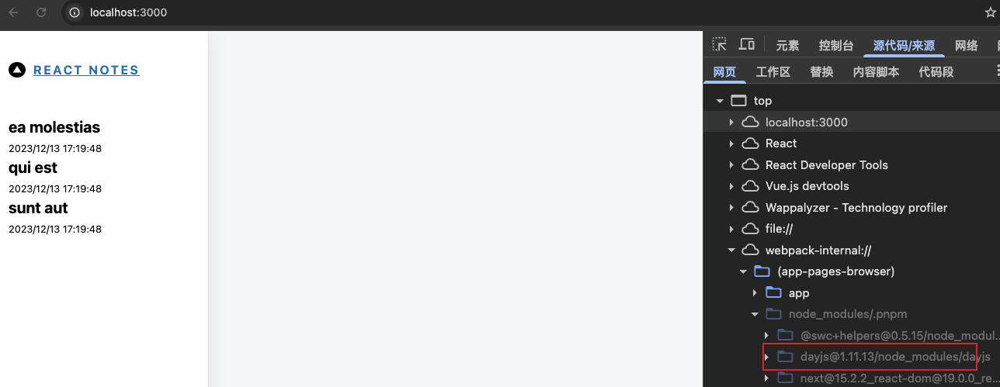

括号中的文件夹将从 URL 中省略（例如(`marketing`)或(`shop`) 。 见：[app/(marketing)/about1/page.tsx](<app/(marketing)/about1/page.tsx>)

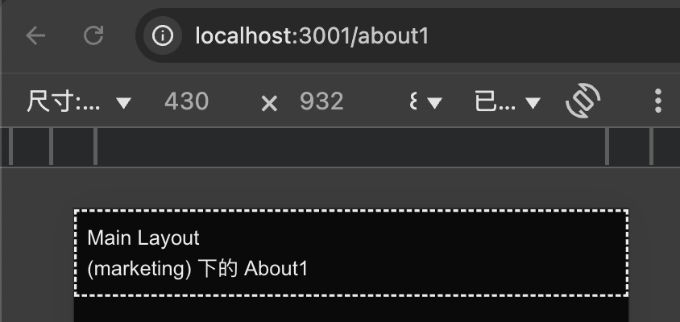

```md
虽然我们使用 (folderName) 的形式进行了逻辑分组，但是其下面的 URL 层次结构不能重复,
比如 (checkout)/about1/page.tsx 与 (marketing)/about1/page.tsx 不能同时存在,这会导致报错。
```

### 2、按逻辑纳入布局

尽管 `(marketing)` 和 `(checkout) `内的路由共享相同的 URL 层次结构，您也可以通过在其文件夹中添加 layout.js 文件为每个组创建不同的布局。
比如我们在 `(checkout)` 中建立 `Layout` 布局，`(checkout)` 外的路线不会共享布局（例如 `marketing` ）。

见：[app/(checkout)/about2](<app/(checkout)/about2>)

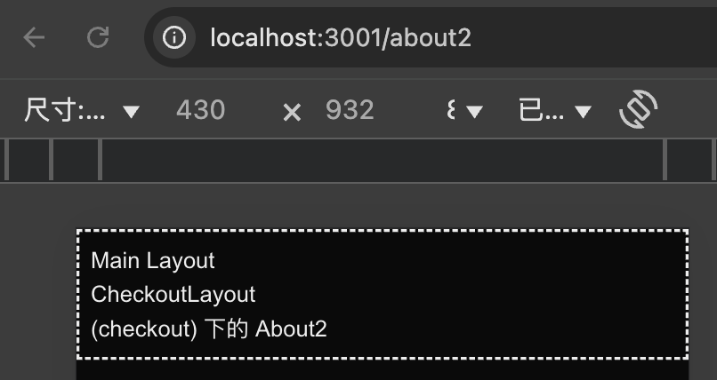

### 3、创建多个根布局

要创建多个根布局，请删除顶层`layout.tsx`文件，并在每个路由组内添加一个`layout.tsx`文件。这对于将应用程序划分为具有完全不同 `UI` 或体验的部分非常有用。需要将`<html>`和`<body>`标签添加到每个根布局。

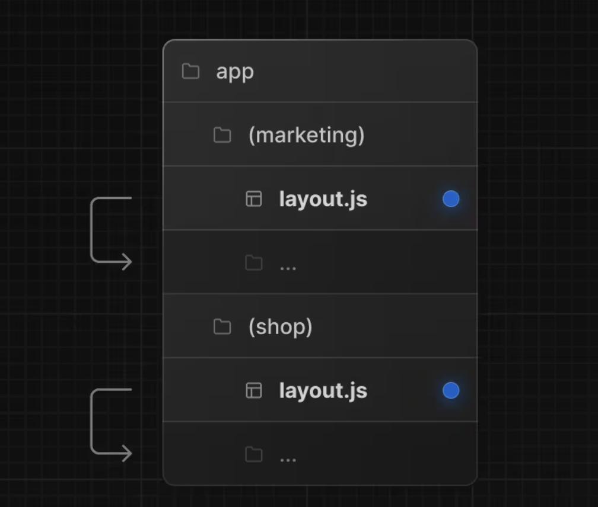

比如你将 `client` 和 `admin` 都放在一个项目里，一个 `C` 端，一个 `B` 端，两个项目的布局肯定不一样，借助路由组，就可以轻松实现区分。

#### 注意：

- 路由组的命名除了用于组织之外并无特殊意义。它们不会影响 URL 路径。
- 注意不要解析为相同的 URL 路径，会导致报错
- 创建多个根布局的时候，因为删除了顶层的 app/layout.js 文件，访问 /会报错，所以 app/page.js 需要定义在其中一个路由组中。例如： app/(marketing)/page.js 。
- 跨多个根布局导航将导致整页加载（与客户端导航不同）。例如，从使用 app/(shop)/layout.js 的/cart 导航到使用 app/(marketing)/layout.js 的/blog 将导致整页加载。这仅适用于多个根布局。

## 三、平行路由（Parallel Routes）

并行路由允许您同时或有条件地在同一布局中渲染一个或多个页面。它们对于应用程序中高度动态的部分非常有用，例如仪表板和社交网站上的提要。
例如，考虑仪表板，您可以使用并行路由同时呈现`team`和`analytics`页面：

### 1、基本使用

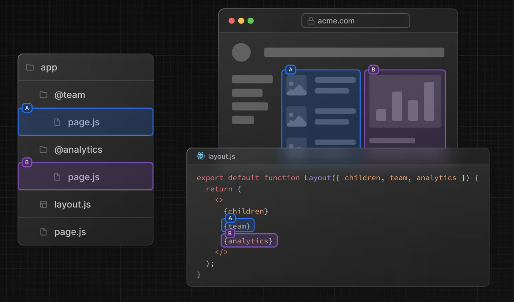

并行路由是使用命名插槽创建的。插槽使用@folder 约定定义。例如，以下文件结构定义了两个插槽：` @analytics`和`@team`

插槽作为 `props` 传递给共享父布局。对于上面的示例，` app/layout.js`中的组件现在接受`@analytics`和`@team`插槽` props`，并且可以与`children prop `并行渲染它们，见：[app/layout.tsx](app/layout.tsx)

```tsx
export default function RootLayout({
  children,
  analytics,
  team,
}: Readonly<{
  children: React.ReactNode;
  analytics: React.ReactNode;
  team: React.ReactNode;
}>) {
  return (
    <html lang="en">
      <body
        className={`${geistSans.variable} ${geistMono.variable} antialiased`}
      >
        <div className="border-2 border-dashed border-white-500 p-2">
          Main Layout
          {children}
          {analytics}
          {team}
        </div>
      </body>
    </html>
  );
}
```

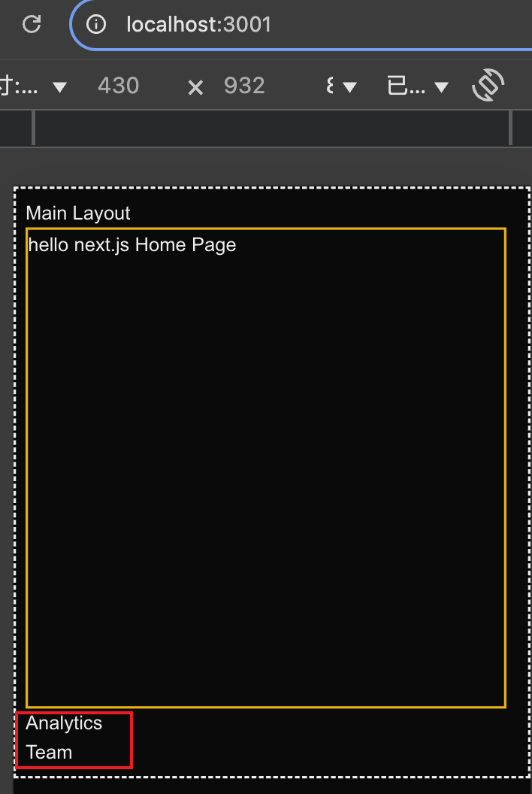

### 2、加载和错误 UI

并行路线可以独立流式传输，允许您为每条路线定义独立的错误和加载状态：

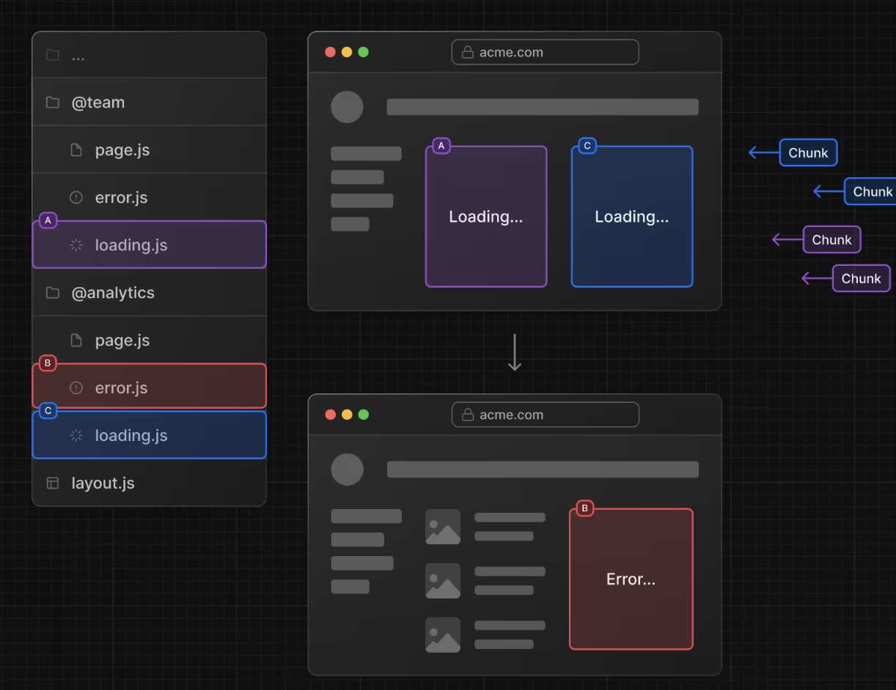

### 3、标签组

您可以在插槽内添加 `layout `，以允许用户独立导航插槽。这对于创建选项卡非常有用。

例如，`@analytics` 插槽有两个子页面： `/page-views` 和 `/visitors`,在 `@analytics` 中，创建一个`layout`文件来在两个页面之间共享标签：

这也就是说，每个插槽都可以有自己独立的导航和状态管理，就像一个小型应用一样。这种特性适合于构建复杂的应用如 `dashboard`，见：[app/@analytics/layout.tsx](app/@analytics/layout.tsx)

```tsx
"use client";

import Link from "next/link";
import { usePathname } from "next/navigation";

const AnalyticsLayout = ({ children }: { children: React.ReactNode }) => {
  const pathname = usePathname();

  return (
    <div className="flex flex-col gap-4 border border-gray-200 p-4 mt-2">
      <h1 className="text-2xl font-bold">Analytics</h1>
      <div>
        <Link
          className={`text-sm text-gray-500 ${
            pathname === "/visitors" ? "text-red-500 font-bold" : ""
          }`}
          href="/visitors"
        >
          Visitors
        </Link>
        <Link
          className={`text-sm text-gray-500 ml-5 ${
            pathname === "/page-views" ? "text-red-500 font-bold" : ""
          }`}
          href="/page-views"
        >
          Page Views
        </Link>
      </div>
      {children}
    </div>
  );
};

export default AnalyticsLayout;
```

当我们点击跳转的时候，对应的页面就会切换，但是这时候当我们刷新页面的时候会展示 `404`，这是为什么呢？该如何解决呢？

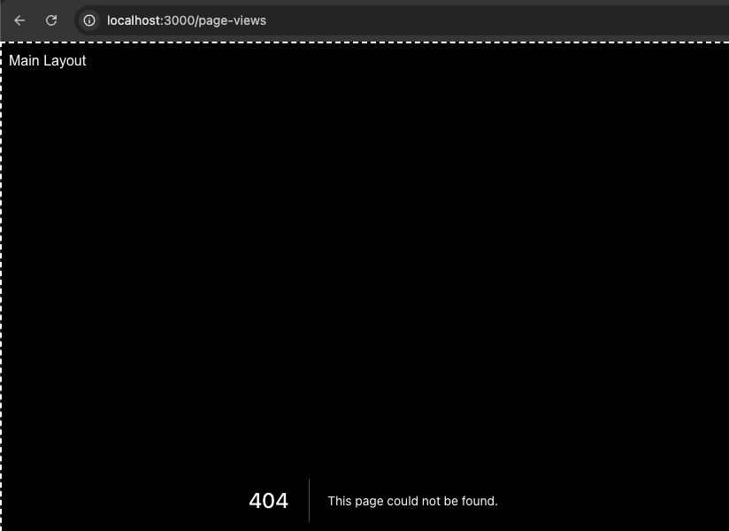

我们可以在 `【活动状态和导航】` 找到答案！

### 4、活动状态和导航

默认情况下，`Next.js `会跟踪每个插槽的活动状态（或子页面）。但是，插槽内呈现的内容将取决于导航类型：

- 软导航：在客户端导航期间，`Next.js` 将执行部分渲染，更改插槽内的子页面，同时维护其他插槽的活动子页面，即使它们与当前 `URL` 不匹配。
- 硬导航：在完整页面加载（浏览器刷新）后，`Next.js` 无法确定与当前 URL 不匹配的插槽是否处于活动状态。相反，它将为不匹配的插槽呈现`default.js`文件，如果`default.js`不存在，则返回 404 。

但是我们明明写了 `app/@analytics/visitors/page.js` 吗？怎么会不匹配呢？对于 `@analytics` 而言，确实是匹配的，但是对于` @team` 和` app/` 就不匹配了！

也就是说，当你访问 `/visitors` 的时候，读取的不仅仅是 `app/@analytics/visitors/page.js`，还有 `app/@team/visitors/page.js` 和 `app/visitors/page.js`

当我们新增[app/@analytics/default.tsx](app/@analytics/default.tsx)和[app/default.tsx](app/default.tsx)后，我们发现就算刷新也不会 404 了

```md
Tip:不匹配路线的 `404` 有助于确保您不会在非预期的页面上意外呈现并行路线。
```

## 三、拦截路由（Intercepting Routes）

拦截路由允许您在当前布局中从应用程序的另一部分加载路由。当您想在用户无需切换到其他上下文的情况下显示路由内容时，此路由范例非常有用。

例如，当点击信息流中的照片时，您可以在模态框中显示该照片，覆盖信息流。在这种情况下，`Next.js` 会拦截`/photo/123`路由，屏蔽 `URL`，并将其覆盖在`/feed`上。

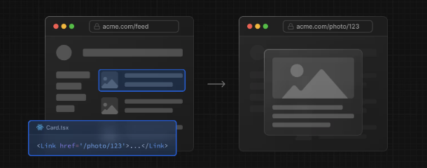

但是，当通过单击可共享 `URL` 或刷新页面导航到照片时，应该呈现整个照片页面，而不是模态框。不应发生路由拦截。

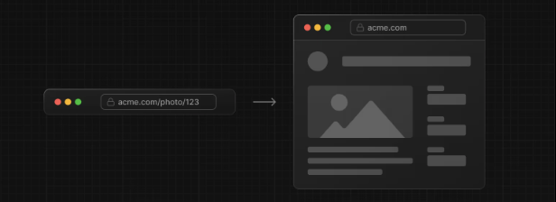

在 `Next.js` 中可以用`(..)`约定来定义

- `(.)` 表示匹配同一层级
- `(..)` 表示匹配上一层级
- `(..)(..)` 表示匹配上上层级。
- `(...)` 表示匹配根目录

例如，您可以通过创建`(..)photo` 目录来从 `feed` 段中拦截 `photo` 段

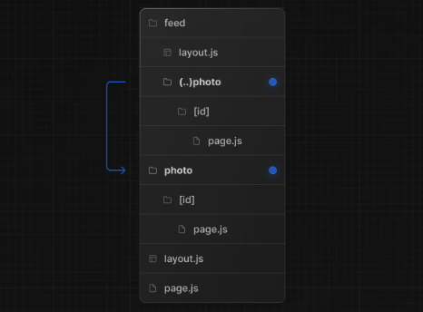

`/feed/(..)photo`对应的路由是 `/feed/photo`，要拦截的路由是 `/photo`，两者只差了一个层级，所以使用 `(..)`。

示例 `demo` 见：

- 分支
  - test_03/InterceptingRoutes_demo

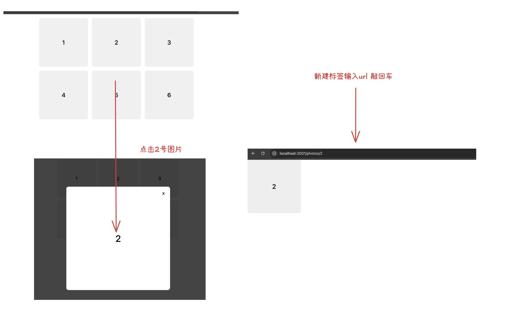
