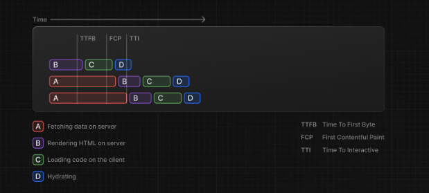

## nextjs 官方文档（current branch 对应如下文档）

[caching](https://nextjs.org/docs/app/building-your-application/caching)

---

## 一、概述

`Next.js` 通过缓存渲染工作和数据请求来提高应用程序的性能并降低成本。本页面详细介绍了 `Next.js` 缓存机制、可用于配置它们的 `API` 以及它们如何相互交互。

| Mechanism 机制                       | What 什么                                    | Where 在哪里     | Purpose 目的                                                                | Duration 期间                                             |
| ------------------------------------ | -------------------------------------------- | ---------------- | --------------------------------------------------------------------------- | --------------------------------------------------------- |
| **Request Memoization**<br>请求记忆  | Return values of functions<br>函数的返回值   | Server<br>服务器 | Re-use data in a React Component tree<br>在 React 组件树中重用数据          | Per-request lifecycle<br>每个请求的生命周期               |
| **Data Cache**<br>数据缓存           | Data<br>数据                                 | Server<br>服务器 | Store data across user requests and deployments<br>跨用户请求和部署存储数据 | Persistent (can be revalidated)<br>持久性（可以重新验证） |
| **Full Route Cache**<br>完整路由缓存 | HTML and RSC payload<br>HTML 和 RSC 有效载荷 | Server<br>服务器 | Reduce rendering cost and improve performance<br>降低渲染成本并提高性能     | Persistent (can be revalidated)<br>持久性（可以重新验证） |
| **Router Cache**<br>路由器缓存       | RSC Payload<br>RSC 有效载荷                  | Client<br>客户端 | Reduce server requests on navigation<br>减少导航时的服务器请求              | 自动失效（如会话期间或 5 分钟临时缓存）                   |

默认情况下，`Next.js` 会尽可能多地缓存以提高性能并降低成本。这意味着路由会静态渲染 ，并且数据请求会被缓存， 除非您选择退出。下图显示了默认的缓存行为：在构建时静态渲染路由时以及首次访问静态路由时。


缓存行为会根据路由是静态呈现还是动态呈现、数据是否缓存以及请求是初次访问还是后续导航而发生变化。您可以根据自己的使用情况，为各个路由和数据请求配置缓存行为。

## 一、请求记忆

`Next.js` 扩展了 `fetch API` ，以自动记住具有相同 `URL` 和选项的请求。这意味着您可以在 `React` 组件树中的多个位置针对同一数据调用 `fetch` 函数，而只需执行一次。


例如，如果您需要跨路由使用相同的数据（例如在布局、页面和多个组件中），则不必在树的顶部获取数据，也不必在组件之间转发 `props`。相反，您可以在需要它的组件中获取数据，而不必担心通过网络对同一数据进行多次请求对性能的影响。

```ts
// app/page.js
async function getItem() {
  // 自动缓存结果
  const res = await fetch("https://.../item/1");
  return res.json();
}

// 函数调用两次，但只会执行一次请求
const item = await getItem(); // cache MISS

const item = await getItem(); // cache HIT
```

请求记忆的工作原理


在渲染路线时，第一次调用特定请求时，其结果将不会在内存中，并且将是缓存 `MISS`

同一次渲染过程中该请求的后续函数调用将会导致缓存命中 `cache HIT` ，数据将从内存中返回，而无需执行该函数。

注意：

- 缓存持续服务器请求的整个生命周期，直到 React 组件树完成渲染。
- 由于记忆不会在服务器请求之间共享并且仅在渲染期间适用，因此无需重新验证它。
- 记忆化仅适用于 `fetch` 请求中的 `GET` 方法，其他方法（例如 `POST` 和 `DELETE` ）不会被记忆化。此默认行为是 `React` 的优化，我们不建议选择退出。

## 二、数据缓存

`Next.js` 具有内置数据缓存，可持久保存传入服务器请求和部署中的数据提取结果。 这是因为 `Next.js `扩展了本机 `fetch API`，以允许服务器上的每个请求设置自己的持久缓存语义。

默认情况下，使用 `fetch` 的数据请求都会被缓存，这个缓存是持久的，它不会自动被重置。你可以使用 `fetch` 的 `cache` 和 `next.revalidate` 选项来配置缓存行为：

```ts
fetch(`https://...`, { cache: "force-cache" | "no-store" });
```

```ts
fetch(`https://...`, { next: { revalidate: 3600 } });
```



让我们解释一下：当渲染的时候首次调用，请求记忆和数据缓存都会 `MISS`，从而执行请求，返回的结果在请求记忆和数据缓存中都会存储一份。

当再次调用的时候，因为添加了 `{cache: 'no-store'}`参数，请求参数不同，请求记忆会 `MISS`，而这个参数会导致数据缓存跳过，所以依然是执行请求，因为配置了 `no-store`，所以数据缓存也不会缓存返回的结果，请求记忆则会正常做缓存处理。

注意：

- 数据缓存在传入请求和部署中都保持不变，除非重新验证或者选择退出。
- 可以通过两种方式重新验证缓存数据：
  - 1、基于时间的重新验证 ：经过一段时间并发出新请求后重新验证数据。这对于不经常更改且新鲜度不那么重要的数据很有用。
  - 2、按需重新验证： 根据事件（例如表单提交）重新验证数据。按需重新验证可以使用基于标签或基于路径的方法一次性重新验证数据组。当您想确保尽快显示最新数据时（例如，当您的无头 CMS 中的内容更新时），这很有用。

基于时间的重新验证，需要使用 `fetch` 的 `next.revalidate` 选项设置缓存的时间（注意它是以秒为单位）。

```ts
// 每小时重新验证
fetch("https://...", { next: { revalidate: 3600 } });
```

```ts
export const revalidate = 3600;
```


通过上图，你可以发现：并不是 60s 后该请求会自动更新，而是 60s 后再有请求的时候，会进行重新验证，60s 后的第一次请求依然会返回之前的缓存值，但 `Next.js` 将使用新数据更新缓存。60s 后的第二次请求会使用新的数据。

<br />
如果想要退出数据缓存有两种方式：

1、一种是将 fetch 的 cache 选项设置为 no-store，示例如下，每次调用的时候都会重新获取数据：

```ts
fetch(`https://...`, { cache: "no-store" });
```

2、一种是使用路由段配置项，它会影响该路由段中的所有数据请求：

```ts
export const dynamic = "force-dynamic";
```
