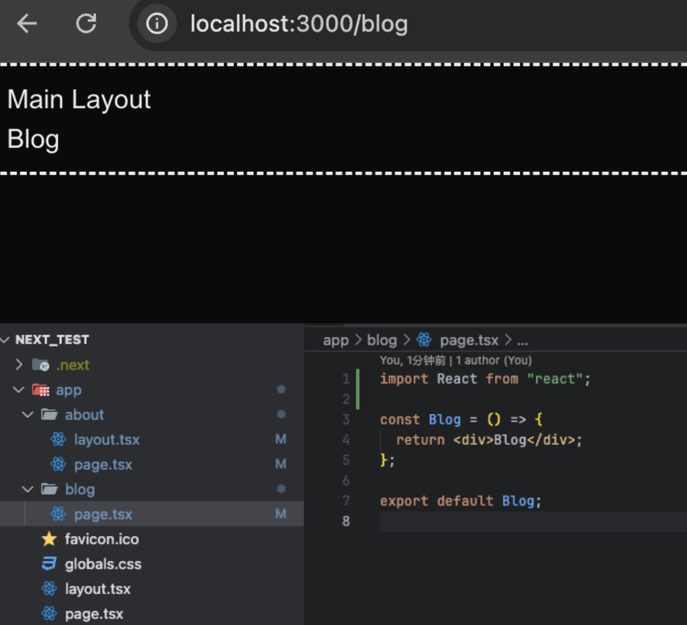
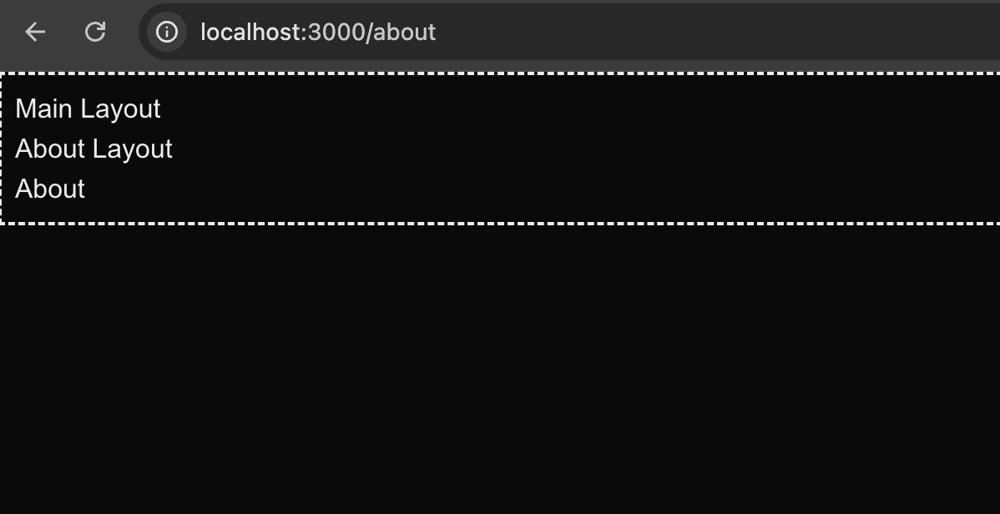
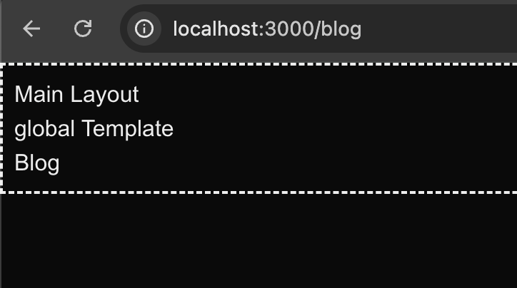
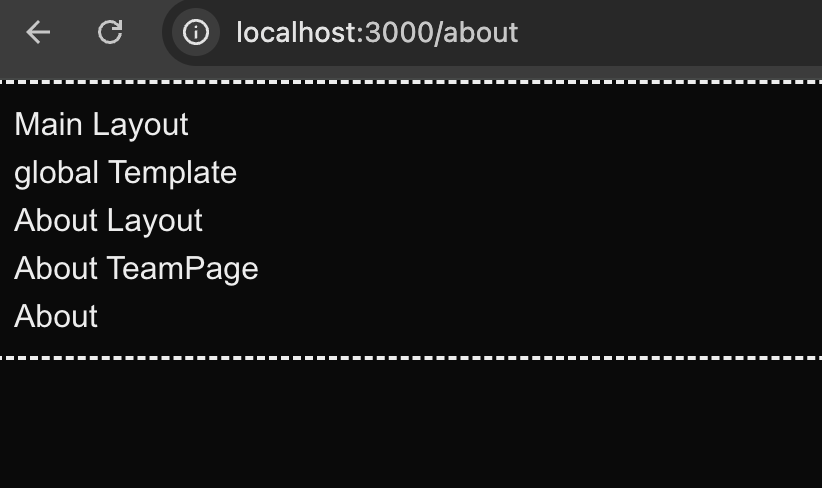
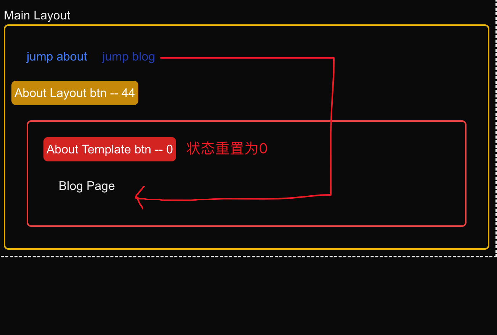
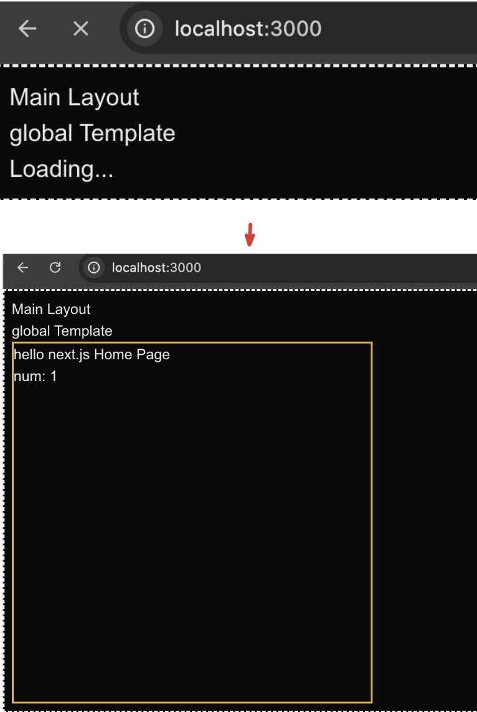

## nextjs 官方文档（current branch 对应如下文档）
- [How to set up a new Next.js project](https://nextjs.org/docs/app/getting-started/installation)
- [Project structure and organization](https://nextjs.org/docs/app/getting-started/project-structure)
- [How to create layouts and pages](https://nextjs.org/docs/app/getting-started/layouts-and-pages)

--- 

## 一、如何创建router

Next.js 使用基于文件系统的路由，这意味着您可以使用文件夹和文件来定义路由。
next.js 约定 使用 page.(js、.jsx、.tsx) 命名为页面

page.js中的代码和平时写react代码一样，例如 [app/page.tsx](app/page.tsx)
```ts
export default function Home() {
  return (
    <div className="border-2 border-yellow-500 w-100 h-100">
      hello next.js Home Page
    </div>
  );
}

```
当我们运行

```base
npm i 
npm run dev
```
  
  打开浏览器访问 http://localhost:3000/about 可以看到，about和blog渲染了其目录下的page.tsx的内容

```yaml
# 如app目录下 
app/about/page.tsx   ->   http://localhost:3000/about
app/blog/page.tsx    ->   http://localhost:3000/blog
```


## 二、layout
### 1、app/layout
app/layout为所有页面根布局，所有的页面都会展示该layout中的内容

该组件应接收一个 children prop，chidren 表示子布局（如果有的话）或者子页面。[app/layout.tsx](app/layout.tsx)
```ts
export default function RootLayout({
  children,
}: Readonly<{
  children: React.ReactNode;
}>) {
  return (
    <html lang="en">
            ...
            ...
          {/* 子组件 这里的children 表示子页面 app/page.tsx */}
          {children}
        </div>
      </body>
    </html>
  );
}
```
- app 目录必须包含根布局，也就是 app/layout.js 这个文件是必需的。
- 根布局必须包含 html 和 body标签，其他布局不能包含这些标签。
- 默认根布局是服务端组件，且不能设置为客户端组件
- 你可以使用路由组创建多个根布局。


### 2、其他页面中的layout
[app/about/layout.tsx](app/about/layout.tsx)

当我们访问 http://localhost:3000/about ，
会展示 app/layout 和 about/layout中的布局，我们可以看到layout是相互嵌套的



### 三、template
模板类似于布局，它也会传入每个子布局或者页面。但不会像布局那样维持状态。

新增[app/template.tsx](app/template.tsx)然后查看 http://localhost:3000/blog 效果如图


我们可以看到他和layout所展示的效果几乎没有任何区别，而他们的包裹关系为：

layout 会包裹 template，template 又会包裹 page

如果您使用过Vue 我们可以吧layout相比与Keep-Alive，而template相比于slot,

如果我们的app/about 也有layout和teamplate 会怎样展示呢？


我们可以看到 `global layout` -> `global template` -> `about layout` -> `about template` -> `about page`

接下来我们编写一个demo来展示 `layout` 和 `template` 他们的对于状态的区别 

见：test_01/layout_template_status_demo 分支，我们可以看到当切换路由的时候，about template 的状态重置为0了



## 四、loading
新增 [app/loading.tsx](app/loading.tsx) 页面
修改 [app/page.tsx](app/page.tsx)页面
```ts
/** 假设为一个获取数字的api */
const fetch_getNumber = async (): Promise<number> => {
  return new Promise((resolve, reject) => {
    setTimeout(() => {
      resolve(1);
    }, 2000);
  });
};

export default async function Home() {
  /** 调用接口，获取num */
  const num: number = await fetch_getNumber();
  /** 先展示 app/loading.tsx 页面，promise进入resolve 状态 展示 app/page.tsx页面 */
  return (
    <div className="border-2 border-yellow-500 w-100 h-100">
      hello next.js Home Page
      <div>num: {num}</div>
    </div>
  );
}

```


loading.tsx 的实现原理是将 page.tsx和下面的 children 用 <Suspense> 包裹。因为page.js导出一个 async 函数，Suspense 得以捕获数据加载的 promise，

借此实现了 loading 组件的关闭。