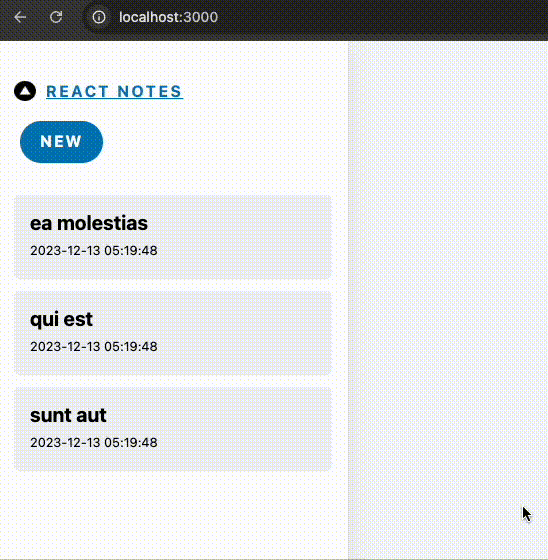
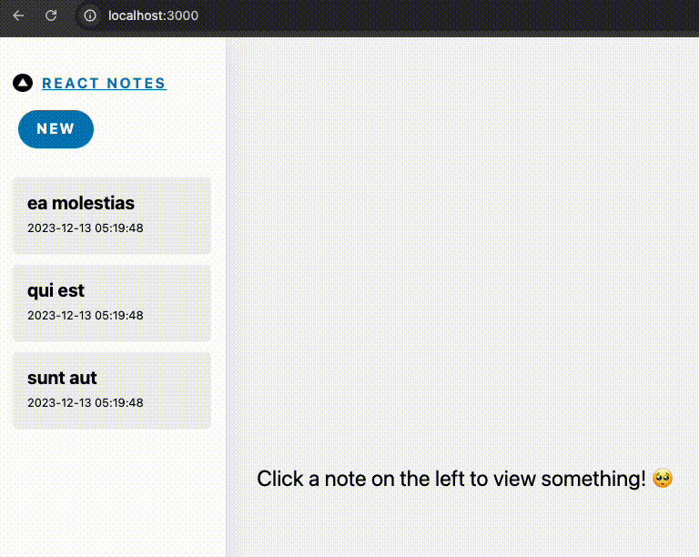
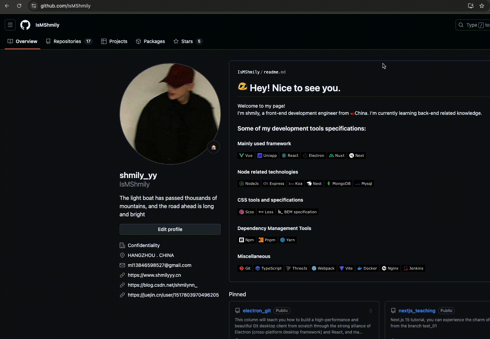

## current branch 对应如下文档

[redis](https://redis.io/docs/latest/operate/oss_and_stack/install/install-stack/mac-os/)

[ioredis](https://github.com/redis/ioredis)

## 一、本节目标

实现笔记列表展开回收和 Suspense 的时实践



## 二、修改根布局和其他页面

修改 [app/components/SidebarNoteList.tsx](https://github.com/IsMShmily/nextjs_teaching/blob/notes_02/app/components/SidebarNoteList.tsx)：

```ts
import SidebarNoteItem from "@/components/SidebarNoteItem";

export default async function NoteList({ notes }) {
  const arr = Object.entries(notes);

  if (arr.length == 0) {
    return <div className="notes-empty">{"No notes created yet!"}</div>;
  }

  return (
    <ul className="notes-list">
      {arr.map(([noteId, note]) => {
        return (
          <li key={noteId}>
            <SidebarNoteItem noteId={noteId} note={JSON.parse(note)} />
          </li>
        );
      })}
    </ul>
  );
}
```

这里我们将具体的每条笔记抽离成单独的 `SidebarNoteItem` 组件，

[app/components/SidebarNoteItem.tsx](https://github.com/IsMShmily/nextjs_teaching/blob/notes_02/app/components/SidebarNoteItem.tsx) 代码如下：

```ts
import dayjs from "dayjs";
import SidebarNoteItemContent from "@/components/SidebarNoteItemContent";

export default function SidebarNoteItem({ noteId, note }) {
  const { title, content = "", updateTime } = note;
  return (
    <SidebarNoteItemContent
      id={noteId}
      title={note.title}
      expandedChildren={
        <p className="sidebar-note-excerpt">
          {content.substring(0, 20) || <i>(No content)</i>}
        </p>
      }
    >
      <header className="sidebar-note-header">
        <strong>{title}</strong>
        <small>{dayjs(updateTime).format("YYYY-MM-DD hh:mm:ss")}</small>
      </header>
    </SidebarNoteItemContent>
  );
}
```

这里我们又抽离了一个 `SidebarNoteItemContent` 组件，用来实现展开和收回功能，我们将笔记的标题和时间的 `JSX` 作为 `children` 传递给了 `SidebarNoteItemContent`

[app/components/SidebarNoteItemContent.tsx](https://github.com/IsMShmily/nextjs_teaching/blob/notes_02/app/components/SidebarNoteItemContent.tsx) 代码如下：

```ts
"use client";

import { useState, useRef, useEffect, useTransition } from "react";
import { useRouter, usePathname } from "next/navigation";

export default function SidebarNoteContent({
  id,
  title,
  children,
  expandedChildren,
}) {
  const router = useRouter();
  const pathname = usePathname();
  const selectedId = pathname?.split("/")[1] || null;

  const [isPending] = useTransition();
  const [isExpanded, setIsExpanded] = useState(false);
  const isActive = id === selectedId;

  // Animate after title is edited.
  const itemRef = useRef(null);
  const prevTitleRef = useRef(title);

  useEffect(() => {
    if (title !== prevTitleRef.current) {
      prevTitleRef.current = title;
      itemRef.current.classList.add("flash");
    }
  }, [title]);

  return (
    <div
      ref={itemRef}
      onAnimationEnd={() => {
        itemRef.current.classList.remove("flash");
      }}
      className={[
        "sidebar-note-list-item",
        isExpanded ? "note-expanded" : "",
      ].join(" ")}
    >
      {children}
      <button
        className="sidebar-note-open"
        style={{
          backgroundColor: isPending
            ? "var(--gray-80)"
            : isActive
            ? "var(--tertiary-blue)"
            : "",
          border: isActive
            ? "1px solid var(--primary-border)"
            : "1px solid transparent",
        }}
        onClick={() => {
          const sidebarToggle = document.getElementById("sidebar-toggle");
          if (sidebarToggle) {
            sidebarToggle.checked = true;
          }
          router.push(`/note/${id}`);
        }}
      >
        Open note for preview
      </button>
      <button
        className="sidebar-note-toggle-expand"
        onClick={(e) => {
          e.stopPropagation();
          setIsExpanded(!isExpanded);
        }}
      >
        {isExpanded ? (
          
        ) : (
          
        )}
      </button>
      {isExpanded && expandedChildren}
    </div>
  );
}
```

这里 `SidebarNoteItemContent` 具体的实现其实并不重要，你只要知道这是一个客户端组件就行了。在这个客户端组件里我们用了 `useState` 来控制展开和收回的状态，然后添加了一些动画效果，仅此而已。如果步骤正确的话，此时的页面效果为：


这个时候你可能会有个疑问：为什么要这样做呢？为什么不直接把 `SidebarNoteItem` 声明为客户端组件，然后直接在这个组件里全部实现呢？还要用传递 `children` 这么复杂的方式？

考验你是否认真学习了之前的知识到了！

在这段代码中，`SidebarNoteItem` 是一个服务端组件，在这个组件中我们引入了 dayjs 这个库，然而我们却是在 `SidebarNoteItemContent` 这个客户端组件中使用的 `dayjs`。请问最终客户端的 `bundle` 中是否会打包 `dayjs` 这个库？


答案是不会。在服务端组件中使用 `JSX` 作为传递给客户端组件的 `prop`，`JSX` 会先进行服务端组件渲染，再发送到客户端组件中。也就是说，发送给客户端组件的并不是：

```ts
<header className="sidebar-note-header">
  <strong>{title}</strong>
  <small>{dayjs(updateTime).format("YYYY-MM-DD hh:mm:ss")}</small>
</header>
```

而是编译后的如：

```ts
<header class="sidebar-note-header">
  <strong>ea molestias</strong>
  <small>2023-12-13 05:19:48</small>
</header>
```

### 三、使用 Suspense 实现骨架图的效果



因为我们现在将笔记列表数据的获取放在了顶层，所以直接为 `SidebarNoteList` 添加 `Suspense` 是没有效果的，我们需要将数据获取改为在 `SidebarNoteList` 组件内部。

修改 [app/components/Sidebar.tsx](https://github.com/IsMShmily/nextjs_teaching/blob/notes_02/app/components/Sidebar.tsx) 代码如下：

```ts
import React, { Suspense } from "react";
import Link from "next/link";
import SidebarNoteList from "../components/SidebarNoteList";
import EditButton from "./EditButton";
import NoteListSkeleton from "./NoteListSkeleton";

export default async function Sidebar() {
  return (
    <>
      <section className="col sidebar">
        <Link href={"/"} className="link--unstyled">
          <section className="sidebar-header">
            
            <strong>React Notes</strong>
          </section>
        </Link>
        <section className="sidebar-menu" role="menubar">
          <EditButton noteId={null}>New</EditButton>
        </section>
        <nav>
          <Suspense fallback={<NoteListSkeleton />}>
            <SidebarNoteList />
          </Suspense>
        </nav>
      </section>
    </>
  );
}
```

添加 [app/components/NoteListSkeleton.tsx](https://github.com/IsMShmily/nextjs_teaching/blob/notes_02/app/components/NoteListSkeleton.tsx)，代码如下：

```ts
export default function NoteListSkeleton() {
  return (
    <div>
      <ul className="notes-list skeleton-container">
        <li className="v-stack">
          <div
            className="sidebar-note-list-item skeleton"
            style={{ height: "5em" }}
          />
        </li>
        <li className="v-stack">
          <div
            className="sidebar-note-list-item skeleton"
            style={{ height: "5em" }}
          />
        </li>
        <li className="v-stack">
          <div
            className="sidebar-note-list-item skeleton"
            style={{ height: "5em" }}
          />
        </li>
      </ul>
    </div>
  );
}
```

[app/components/SidebarNoteList.tsx](https://github.com/IsMShmily/nextjs_teaching/blob/notes_02/app/components/SidebarNoteList.tsx) 代码如下，为了让效果更加明显，我们添加了一个 `sleep` 函数：

```ts
import SidebarNoteItem from "../components/SidebarNoteItem";
import { getAllNotes } from "@/lib/redis";

export default async function NoteList() {
  const sleep = (ms: number) => new Promise((r) => setTimeout(r, ms));
  await sleep(1000);
  const notes = await getAllNotes();

  const arr = Object.entries(notes);
  if (arr.length == 0) {
    return <div className="notes-empty">{"No notes created yet!"}</div>;
  }

  return (
    <ul className="notes-list">
      {arr.map(([noteId, note]) => {
        return (
          <li key={noteId}>
            <SidebarNoteItem noteId={noteId} note={JSON.parse(note)} />
          </li>
        );
      })}
    </ul>
  );
}
```

此时页面效果如下：


那么问题来了，`SidebarNoteList` 用 `Suspense` 和不用 `Suspense`，具体有什么改变呢？

我们把 `sleep` 的时间设置为 `3s`。这是不使用 `Suspense` 的效果，我们从 `github` 主页输入地址 http://localhost:3000/：


输入地址后，我们等待了大概 `3s` 后，页面突然完全展现。

这是使用 Suspense 的效果，我们还是从`github` 主页输入地址 http://localhost:3000/：



我们可以看到，使用 `Suspense`，数据加载不会阻塞页面，也就是说在笔记列表还在加载的时候，用户依然可以与页面其他部分进行交互，比如点击 `New` 按钮新建笔记。
