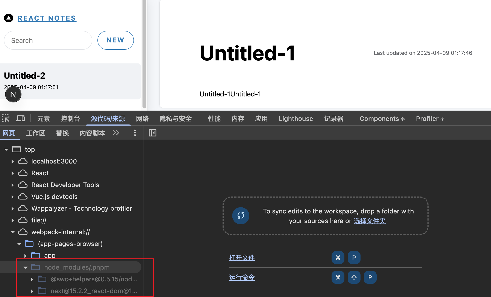

## nextjs 官方文档（current branch 对应如下文档）

- [Client Components](https://nextjs.org/docs/app/building-your-application/rendering/client-components)
- [server-components](https://nextjs.org/docs/app/building-your-application/rendering/server-components)

---

## 一、Client Components 客户端组件

### 1、使用 Client Components

客户端组件允许您编写在服务器上预渲染的交互式 `UI` 并且可以使用客户端 `JavaScript` 在浏览器中运行。

本页将介绍客户端组件的工作原理、如何呈现以及何时使用它们。

在客户端进行渲染工作有几个好处，包括：

- 交互性 ：客户端组件可以使用状态、效果和事件监听器，这意味着它们可以向用户提供即时反馈并更新 `UI`。
- 浏览器 API ：客户端组件可以访问浏览器 `API`，例如地理位置或 `localStorage` 。

"`use client`" 用于声明服务器和客户端组件模块之间的边界 。这意味着，通过在文件中定义 "`use client`" ，导入到其中的所有其他模块（包括子组件）都被视为客户端包的一部分。

见：[app/page.tsx](app/page.tsx)

```tsx
"use client";

import { useState } from "react";

export default function Home() {
  const [count, setCount] = useState(0);
  return (
    <div>
      <p>You clicked {count} times</p>
      <button onClick={() => setCount(count + 1)}>Click me</button>
    </div>
  );
}
```

下图显示，如果未定义 "`use client`" 指令，则在嵌套组件 ( `toggle.js` ) 中使用 `onClick` 和 `useState` 将导致错误。这是因为默认情况下，应用路由器中的所有组件都是服务器组件，这些 `API` 不可用。通过在 `toggle.js` 中定义 "`use client`" 指令，您可以告诉 `React` 进入这些 `API` 可用的客户端边界。


<br />

### 2、Client Components 如何呈现

在 `Next.js` 中，客户端组件的呈现方式取决于请求是完整页面加载的一部分（**对应用程序的首次访问或由浏览器刷新触发的页面重新加载**）还是后续导航。

为了优化初始页面加载，`Next.js` 将使用 `React` 的 `API` 在服务器上为客户端和服务器组件呈现静态 `HTML` 预览。这意味着，当用户首次访问您的应用程序时，他们将立即看到页面内容，而无需等待客户端下载、解析和执行客户端组件 `JavaScript` 包。

当我们访问一个 `nextjs` 网站时：

服务器中：

- `React` 将服务器组件渲染为一种称为 `React` 服务器组件负载（`RSC Payload`） 的特殊数据格式，其中包含对客户端组件的引用。

- `Next.js` 使用 `RSC Payload` 和客户端组件 `JavaScript` 指令在服务器上呈现路由的 `HTML` 。

```md
TIP:
RSC payload 中包含如下这些信息：

服务端组件的渲染结果
客户端组件占位符和引用文件
从服务端组件传给客户端组件的数据
```

客户端中：

- `HTML` 用于立即显示路线的快速非交互式初始预览。
- `React Server Components Payload` 用于协调客户端和服务器组件树，并更新 `DOM`。
- `JavaScript` 指令用于水合客户端组件并使其 `UI` 具有交互性。

```md
TIP:
什么是水合（Hydration）？
Hydration 是将事件监听器附加到 DOM 的过程，以使静态 HTML 具有交互性。在后台，hydration 是通过 hydrateRoot 完成的反应 API。
```


其中 SC 为服务端组件、CC 为客户端组件
<br />
<br />
<br />

后续导航跳转：

在后续导航中，客户端组件完全在客户端上呈现，而无需服务器呈现的 `HTML`。

这意味着客户端组件 `JavaScript` `包已下载并解析。一旦包准备就绪，React` 将使用 `RSC Payload` 协调客户端和服务器组件树，并更新 `DOM`。



#### 总结：

- 1、客户端组件可以使用浏览器的 API 而 服务端组件不可以
- 2、使用 use client 标记的组件定义为客户端组件，导入到其中的所有其他模块（包括子组件）都被视为客户端包的一部分。
- 3、服务端组件可以直接导入客户端组件，但客户端组件并不能导入服务端组件

## 二、如何使用 Client Component

### 1、基本使用

Server component 见：[app/home/[id]/page.tsx](app/home/[id]/page.tsx)

```tsx
import ClientComponent from "../components/ClientComponents";

// 默认为服务端组件
const Home = async ({ params }: { params: Promise<{ id: string }> }) => {
  const { id } = await params;
  return (
    <div>
      Server Component - {id}
      <ClientComponent />
    </div>
  );
};

export default Home;
```

Client component 见：[app/home/components/ClientComponents.tsx](app/home/components/ClientComponents.tsx)

```ts
"use client";

import { useState } from "react";
const ClientComponent = () => {
  const [count, setCount] = useState(0);
  return (
    <div className="border border-red-500">
      <p>You clicked {count} times</p>
      <button onClick={() => setCount(count + 1)}>Click me</button>
    </div>
  );
};

export default ClientComponent;
```

### 2、最佳实践

为了尽可能减少客户端 `JavaScript` 包的大小，尽可能将客户端组件在组件树中下移。

举个例子，当你有一个包含一些静态元素和一个交互式的使用状态的搜索栏的布局，没有必要让整个布局都成为客户端组件，将交互的逻辑部分抽离成一个客户端组件（比如`<SearchBar />`），让布局成为一个服务端组件：

```ts
// SearchBar 客户端组件
import SearchBar from "./searchbar";
// Logo 服务端组件
import Logo from "./logo";

// Layout 依然作为服务端组件
export default function Layout({ children }) {
  return (
    <>
      <nav>
        <Logo />
        <SearchBar />
      </nav>
      <main>{children}</main>
    </>
  );
}
```

## 三、客户端组件 VS 服务端组件

### 1、区别

| 特性         | 服务端组件(RSC)                        | 客户端组件             |
| ------------ | -------------------------------------- | ---------------------- |
| **渲染位置** | 服务端                                 | 浏览器                 |
| **数据获取** | 直接访问数据库/API，支持 `async/await` | 通过公开 API 调用      |
| **交互性**   | 无                                     | 支持事件、状态、Effect |
| **使用场景** | SEO、静态内容、敏感操作                | 动态交互、第三方库集成 |
| **性能优化** | 减少客户端 JS，自动缓存                | 代码分割、懒加载       |
