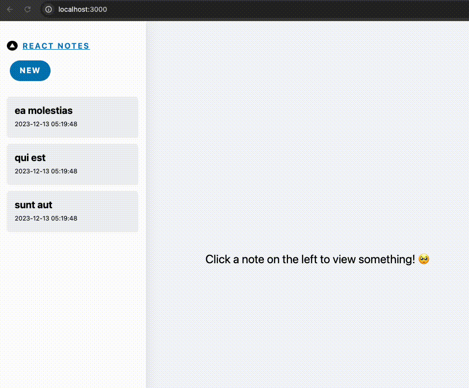

## nextjs 官方文档（current branch 对应如下文档）

[static-rendering-default](https://nextjs.org/docs/app/building-your-application/rendering/server-components#static-rendering-default)

[dynamic-rendering](https://nextjs.org/docs/app/building-your-application/rendering/server-components#dynamic-rendering)

[partial-prerendering](https://nextjs.org/docs/app/building-your-application/rendering/partial-prerendering)

[partial-rendering](https://nextjs.org/docs/app/building-your-application/routing/linking-and-navigating#4-partial-rendering)

---

## 引言：

新建：[app/server/page.tsx](app/server/page.tsx) 如下

```ts
const ServerPage = async () => {
  // 获取一张随机图片
  const randomImage = await fetch("https://api.thecatapi.com/v1/images/search");
  const imageData = await randomImage.json();
  const imageUrl = imageData[0].url;

  return (
    <div>
      
    </div>
  );
};

export default ServerPage;
```

当我们刷新页面的时候，每次都会调用 `img search` 的接口 获取一张猫猫图片：`pnpm run dev `打开 http://localhost:3000/server 我们可以看到



修改 [package.json](package.json) `build` 命令为 `"build": "next build && next start",` 打包运行 http://localhost:3000/server 页面，我们发现 刷新页面，猫猫图片也不会更新了


让我们查看 `build` 输出的结果：


`/server` 被标记为 `Static`，表示被预渲染为静态内容。也就是说，`/server` 的返回内容其实在构建的时候就已经决定了。页面返回的图片正是构建时调用猫猫接口返回的那张图片。

那么如何让 `/server` 每次都返回新的图片呢？这就要说到 `Next.js` 的服务端渲染策略了。

## 一、静态渲染

## 二、动态渲染

## 三、其他策略

### 1、局部渲染

### 2、动态路由

### 3、动态段
